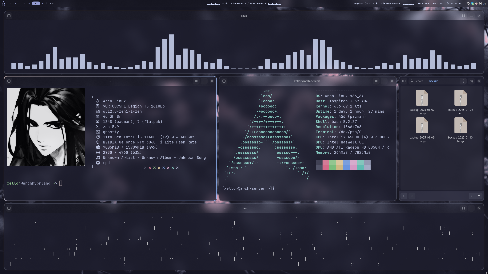

# 🖥️ My Hyprland Config



Welcome to my Hyprland configuration repository! 🌟 This setup is tailored for a sleek, modern, and highly customizable desktop experience on Arch Linux.

---

## 🔧 Features

- **Window Manager**: [Hyprland](https://github.com/hyprwm/Hyprland) - A dynamic Wayland compositor.
- **Bar**: [Waybar](https://github.com/Alexays/Waybar) - Highly customizable and beautiful status bar.
- **Launcher**: [Rofi](https://github.com/davatorium/rofi) - Fast and efficient application launcher.
- **Notifications**: [Swaync](https://github.com/ErikReider/SwayNotificationCenter) - Notification daemon for Wayland.
- **System Info**: [Neofetch](https://github.com/dylanaraps/neofetch) - Shows system information in terminal.
- **Wallpapers**: A collection of stunning wallpapers in `.wallpapers`.

---

## 📂 Directory Structure

```plaintext
.
├── hypr/               # Hyprland configuration files
├── waybar/             # Waybar configuration and styles
├── rofi/               # Rofi themes and scripts
├── swaync/             # Swaync notification center configs
├── neofetch/           # Neofetch ASCII art and config
├── .wallpapers/        # Wallpaper collection
└── README.md           # This file
